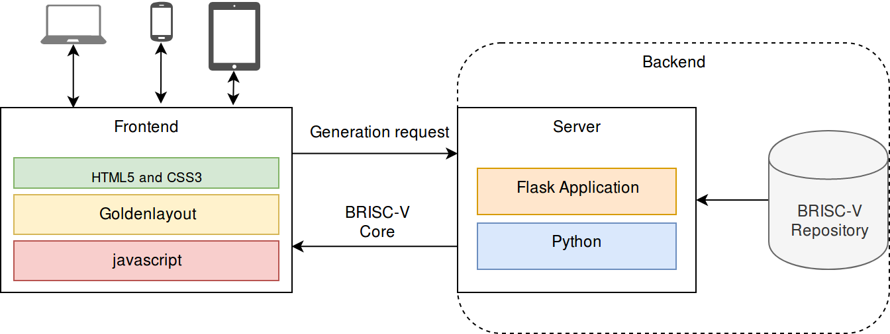

# Boston University RISC-V Explorer

## Project Description
BRISC-V Explorer is a web application which allows for __design space exploration__ for an
__open source__ RISC-V implementation written in Verilog 2001. The aim is allow both students
and researchers to quickly configure a starting point for hardware design to avoid the work 
of starting from scratch.

## User Stories
The theme for these stories is __researchers__ and __students__
- As a user I want to choose the number of stages in my processor pipeline
- As a user I want to choose if my processor pipeline is stalled or bypassed
- As a user I want to select the number of cores included in the final design
- As a user I want to select the width of my address bus
- As a user I want to select the width of my data bus
- As a user I want to load configuration parameters saved in a file
- As a user I want to set the associativity of L1 and L2 caches
- As a user I want to set the number indices for L1 and L2 caches
- As a user I want set the number of cache lines for L1 and L2 caches
- As a user I want to select the number of cache levels
- As a user I want to set the size of available main memory
- As a user I want to see the block diagram reflecting my chosen parameters

## System Architecture
BRISC-V is a one page web application with a backend component handling the Verilog source generation.

## Sprint Goals

### Sprint 1

- ~~Meet with stakeholders to discuss requirements~~
- ~~Identify any additional features that could be added~~
- ~~Create requirements document and get approval from stakeholders~~
- ~~Identify needed technology to support user stories~~

### Sprint 2

- Define needed window panes
- Decide on a golden layout scheme
- Create javascript functions to capture configuration parameters
- Decide on communication between backend server and frontend

### Sprint 3

- Implement git repository functions on backend (might use [GitPython](https://github.com/gitpython-developers/GitPython) for this)
  - fetching metadata
  - issues
  - latest versions
  - clone and pull
 - Design module configuration logic
 - Implement communication logic between front end and backend

### Sprint 4
TODO: Add goals here
